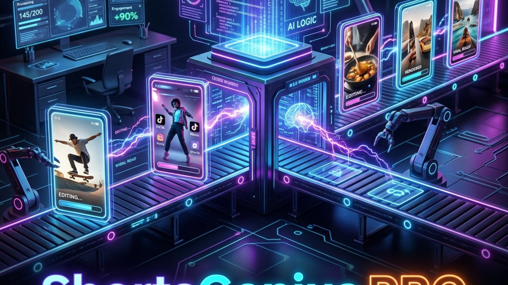

# 🎬 ShortsGenius PRO



An enterprise-grade, Remotion-based automated video generator designed to programmatically construct, render, and deploy highly engaging vertical video content (YouTube Shorts, TikToks, Instagram Reels) with zero manual editing.

## 🚀 Features & Architecture

- **Automated Render Pipeline:** Built on Remotion & React for deterministic, code-driven video synthesis.
- **Multiple Content Types:** Natively supports "Question + Punchline" formats with automated suspense timing, as well as auto-paced "Story" modes.
- **Dynamic Theming:** Configurable dark/light modes, accent colors, and custom typography to perfectly match your brand kit.
- **API-Ready & Cron Friendly:** Easily integrates into n8n workflows, Python orchestrators, or basic `cron` jobs for "set and forget" publishing pipelines.
- **High-Fidelity Output:** Configurable 1080x1920 30FPS H.264 rendering out of the box.

## 🛠️ Quick Start Guide

### 1. Installation

Clone the repository and install the required dependencies (Node 18+ and FFmpeg required):

```bash
npm install
```

### 2. Configuration

Set up your video blueprint by copying the example configuration:

```bash
cp joke-config.example.json joke-config.json
```

### 3. Supply Your Assets

Drop your TTS (Text-to-Speech) audio files directly into the `public/` directory:
- `public/question.mp3`
- `public/punchline.mp3`

### 4. Execute Render

Run the CLI render script to synthesize the final video:

```bash
npx ts-node render.ts --config joke-config.json
```

The compiled high-definition MP4 will be deposited in the `out/` directory, ready for upload.

## 👨‍💻 CLI Arguments

For integrations that don't rely on JSON configuration files, you can pass arguments directly:

```bash
npx ts-node render.ts \
  --type question-punchline \
  --question "Why do programmers prefer dark mode?" \
  --question-audio question.mp3 \
  --question-duration 2.5 \
  --punchline "Because light attracts bugs!" \
  --punchline-audio punchline.mp3 \
  --punchline-duration 1.8 \
  --output final_export.mp4
```

## 🧪 Development & Preview

Need to tweak the animations or adjust styling? Launch the Remotion Studio to preview the React composition in real-time before rendering.

```bash
npx remotion studio src/remotion/index.ts
```

## 🔒 Security Notice
This repository contains no hardcoded credentials or API tokens. When integrating with YouTube/TikTok APIs, ensure your tokens are properly added to `.gitignore` and managed securely.

## 📜 License
MIT License
